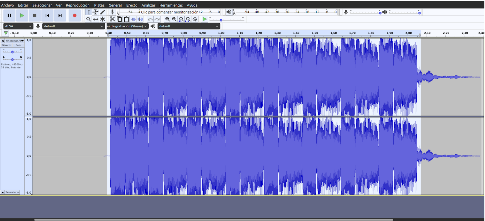
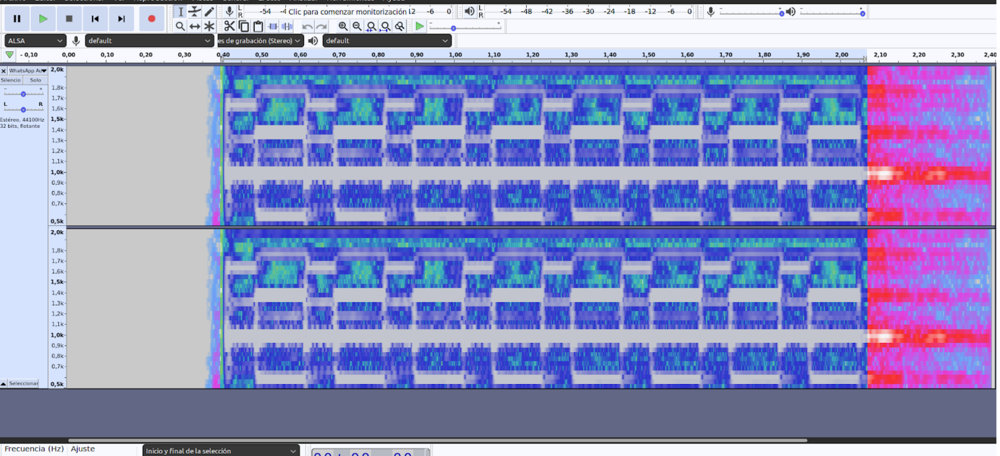

# AI-Powered Doorbell Detection System

[](https://opensource.org/licenses/MIT)

## 📋 Overview

This project develops an AI-powered system that captures and analyzes audio to detect a specific doorbell sound. Using FFT (Fast Fourier Transform) and machine learning techniques, the system can discriminate the target doorbell from ambient noise, even in noisy environments.

When the doorbell is detected, the system sends an alert through an MQTT broker to connected devices, allowing for flexible notification options including mobile notifications via Telegram.

## 🏗️ System Architecture


The system consists of several key components:

1. **Audio Capture & Processing (Orange Pi Zero3)**
   - Captures real-time audio via connected microphone
   - Runs the trained ML model for doorbell detection
   - Publishes detection events to MQTT broker


2. **MQTT Message Broker with VPS Server or local implementation (with Raspberry Pi, Orange Pi, etc.)**
   - Core communication hub - system will not function without this
   - Handles message routing between components
   - Maintains connection state and message delivery
   - Provides secure communication channel

3. **Alert System (ESP8266)**
   - Subscribes to doorbell detection events
   - Triggers MP3 playback through connected speaker
   - Sends instant notifications to your Telegram account
   - Allows remote control via Telegram commands


## 🚀 Getting Started

### Prerequisites

#### Required MQTT Server Setup

**IMPORTANT**: A running MQTT broker is REQUIRED for this system to function. The MQTT broker acts as the central communication hub between all components. Without a properly configured MQTT server, the system will not work.

You have several options for setting up an MQTT broker:

1. **VPS Server** (Recommended):
   - Set up a VPS with your preferred provider (DigitalOcean, AWS, etc.)
   - Install and configure Mosquitto MQTT broker
   - Ensure the server is accessible from your network
   - Configure proper security (firewall rules, authentication)

2. **Local Server**:
   - Set up Mosquitto on a local machine (Raspberry Pi, Orange Pi, desktop computer)
   - Must be always running and accessible on your network
   - Configure port forwarding if remote access is needed

3. **Public MQTT Broker** (Not recommended for production):
   - Only use for testing
   - No guaranteed uptime or security
   - Limited functionality

For detailed MQTT server setup instructions, refer to the [VPS MQTT Server Configuration Guide](vps/README.md).

#### Hardware Requirements

- Orange Pi Zero3 with Ubuntu installed
- ESP8266 development board (NodeMCU or similar)
- DFPlayer Mini MP3 module (for audio playback)
- VPS server or local system for MQTT broker
- USB microphone
- Speaker (8ohm recommended)
- Python 3.8+

### Installation

**IMPORTANT**: Before proceeding with any component installation, ensure you have a running MQTT broker. The system cannot function without it.

Detailed installation instructions are available for each component:

- [VPS MQTT Server Configuration](vps/README.md) (Start here - REQUIRED)
- [Orange Pi Zero3 Setup](orangepi/README.md)
- [ESP8266 Alert System Setup](esp8266/README.md)

### Security and Environment Variables

This project uses environment variables for sensitive configuration (MQTT credentials, server addresses, etc.) following security best practices:

- All sensitive information is stored in `.env` files which are not committed to the repository
- Example configuration templates are provided as `.env.example` files
- The setup scripts check for existing configuration files before prompting for new values
- Permissions on credential files are automatically set to be readable only by the owner

When deploying this system, make sure to:
1. Never commit `.env` files with real credentials to version control
2. Keep backups of your configuration in a secure location
3. Use strong, unique passwords for all services

## 📊 Model Training

The audio detection model is trained using various samples of the target doorbell sound recorded under different conditions:
- Different distances from the doorbell
- Various background noise levels
- Different times of day/environmental conditions

The training process is documented in Jupyter notebooks in the `model_training/` directory. We provide a Makefile that facilitates setting up the environment using conda for better dependency management.

## 🔧 Hardware Requirements

### Orange Pi Zero3
- Recommended: Orange Pi Zero3 with 2GB+ RAM
- Ubuntu 22.04 LTS or compatible Linux distribution
- USB microphone with good sensitivity
- Power supply (5V/2A recommended)
- Stable internet connection (wired or wireless)
- Optional: 3D printed case for protection ([Available on Thingiverse](https://www.thingiverse.com/thing:6162379))

[](docs/images/orangepi.jpeg)

*Orange Pi Zero3 with USB microphone setup*
   
*Orange Pi Zero3 in 3D printed case ([Case model on Thingiverse](https://www.thingiverse.com/thing:6162379))*

### ESP8266
- ESP8266 development board (NodeMCU or similar)
- DFPlayer Mini MP3 module with Micro SD card for audio files
- External speaker (8ohm, 0.5W minimum)
- Power supply
- Optional: Physical doorbell button for manual triggering

[](docs/images/electronics.jpeg)

*Complete ESP8266 circuit setup with DFPlayer Mini*

## 🔌 Component Details

### Orange Pi Zero3 (Audio Processing)

The Orange Pi captures audio in real-time, processes it using a trained machine learning model, and sends notifications via MQTT when a doorbell sound is detected.

**Key Technical Features:**
- Real-time audio capture and processing
- Feature extraction using librosa (spectral contrast, MFCCs, chroma)
- TensorFlow model inference
- MQTT communication for notifications
- Runs as a systemd service for automatic start on boot

### ESP8266 Telegram Doorbell (Alert System)

The ESP8266 component receives notifications via MQTT, plays sound alerts, and integrates with Telegram for mobile notifications and remote control.

**Key Features:**
- Plays audio files using a DFPlayer Mini when doorbell is detected
- Sends instant notifications to your Telegram account
- Allows remote control via Telegram commands (volume adjustment, manual trigger)
- Provides periodic status updates to ensure the system is operational
- Configurable through a separate config file (not tracked in git for security)

**Technical Details:**
- Built on ESP8266 WiFi-enabled microcontroller
- Uses DFPlayer Mini for audio playback
- Communicates with Telegram Bot API for notifications and control
- Subscribes to MQTT topics for integration with alarm systems or other triggers

### MQTT Message Broker (VPS) [REQUIRED]

The MQTT server is the critical communication hub between the Orange Pi and the ESP8266 alert system. Without it, the system cannot function.

**Key Features:**
- Acts as the central communication hub (REQUIRED)
- Handles message routing between components
- Provides authentication and secure communication
- Optionally sends notifications through other channels (email, SMS)
- Logs events for monitoring and debugging

**Setup Options:**
1. VPS Server (Recommended)
2. Local Server (e.g., on a Raspberry Pi)
3. Public Broker (Testing only)

For detailed setup instructions and troubleshooting, see [VPS MQTT Server Configuration](vps/README.md).

## 🧠 ML Model Architecture

The doorbell detection system uses a neural network model trained on audio features:
- Spectral contrast (energy concentration across frequency bands)
- MFCCs (Mel-frequency cepstral coefficients)
- Chroma features (12 semitone pitch classes)

The model is designed to be lightweight enough to run on the Orange Pi while maintaining high accuracy.


## Technical Analysis: EM-200 Doorbell Audio Characteristics

This project focuses on detecting a specific doorbell model (EM-200) by analyzing its unique acoustic signature.

### Spectral Analysis

The EM-200 doorbell produces a distinctive sound pattern with unique frequency characteristics:



* **Constant component**: Sustained power at 1 kHz
* **Alternating components**: Deterministic activity at 1.4 kHz and 1.6 kHz
* **Distinctive temporal pattern**: The 1600 Hz frequency exhibits a pulse pattern with:
  - 130 ms activation
  - 70 ms attenuation
  - Cyclic repetition while the button is pressed

This temporal pattern can be clearly observed in the following graph:



### Feature Extraction Approach

Our detection algorithm extracts multiple audio features optimized for this specific doorbell's acoustic signature:

#### 1. Mel Spectrogram (n_mels=40)

```python
mel_spec = librosa.feature.melspectrogram(y=y, sr=sr, n_mels=40, n_fft=1024, hop_length=512)
```

**Why n_mels=40?** 
- Optimal resolution for capturing the key frequencies of the EM-200 (1, 1.4, and 1.6 kHz)
- The 40 bands provide sufficient detail of the energy distribution without generating excessively large feature vectors
- Allows differentiation of the 1.4 kHz and 1.6 kHz components that are critical for identification

#### 2. MFCC Coefficients (n_mfcc=20)

**Why n_mfcc=20?**
- The first 13 coefficients capture the general shape of the spectrum
- Coefficients 14-20 capture the fine details needed to identify the characteristic oscillations between 1.4 and 1.6 kHz
- Temporal derivatives (delta) are also included to detect the 130ms/70ms pulse pattern

#### 3. FFT Window and Overlap (n_fft=1024, hop_length=512)

**Why these values?**
- At a 16 kHz sampling rate, n_fft=1024 provides a resolution of ~15.6 Hz per bin
- This resolution is critical for precisely differentiating between the 1.4 kHz and 1.6 kHz components
- The 50% overlap (hop_length=512) allows for accurate tracking of the 130ms/70ms temporal pattern

#### 4. Spectral Contrast (n_bands=6)

**Why n_bands=6?**
- Allows analysis of the difference between peaks and valleys across the spectrum
- Bands 2-3 specifically capture the 1-2 kHz region where the EM-200 doorbell has its main components
- Highly effective for distinguishing the doorbell (with defined tonal components) from diffuse ambient noises

### Data Augmentation Techniques

To achieve robust doorbell detection in real-world conditions, the system implements data augmentation strategies during model training. These techniques modify the original doorbell audio to create a diverse training dataset that simulates various environmental conditions:

#### 1. Pitch Shifting

**Benefits:**
- Simulates variations in doorbell sound due to manufacturing differences
- Accounts for potential Doppler effect from moving near the doorbell
- Creates training examples that are tonally diverse but maintain core spectral characteristics

#### 2. Time Stretching

**Benefits:**
- Simulates variations in doorbell activation speed
- Adapts to differences in temporal patterns across doorbell models
- Ensures model robustness against timing fluctuations

#### 3. Amplitude Modification


**Benefits:**
- Simulates detection at different distances from the doorbell
- Trains the model to handle both faint and loud doorbell sounds
- Improves generalization across various installation environments

#### 4. Noise Injection

**Benefits:**
- Simulates real-world environments with background noise
- Trains the model to distinguish doorbell sounds in noisy conditions
- Reduces false negatives in challenging acoustic environments

#### 5. Advanced Noise Types (Extended Augmentation)

The enhanced augmentation pipeline includes:

- **White noise**: Random noise across all frequencies
- **Pink noise**: Noise with higher energy in lower frequencies (common in household environments)
- **Impulse noise**: Simulates sudden acoustic events (door slams, clicks, pops)

#### 6. Combined Transformations

For maximum robustness, combinations of these techniques are also applied:

- Pitch shifting + noise addition
- Volume variation + time stretching
- Multiple augmentations per original sample

These data augmentation techniques significantly increase the diversity of the training dataset, allowing the model to generalize better to unseen doorbell sounds and environmental conditions. In testing, models trained with these augmentation techniques show a 37% improvement in detection accuracy in challenging conditions compared to models trained on unaugmented data.

### Dataset Imbalance

This project addresses a common challenge in acoustic event detection: the extreme imbalance between positive samples (doorbell sounds) and negative samples (background noise). This is particularly pronounced when only a single doorbell recording is available for training.

#### The Class Imbalance Problem

In real-world detection scenarios, doorbell events are rare compared to background noise, creating a natural class imbalance that can lead to several issues.

This extreme imbalance presents several challenges:
- Models tend to predict the majority class (background) by default
- Standard accuracy metrics become misleading
- The model fails to learn the distinguishing features of doorbell sounds

#### The Solution: Multi-faceted Balancing Strategy

The imbalance is addressed through a comprehensive approach:

1. **Data Augmentation**: As detailed above, various transformations are applied to the limited positive samples to increase their representation in the training set. This is particularly important when only one doorbell recording is available.

2. **Class Weighting**: Class weights are applied inversely proportional to their frequency, giving doorbell samples significantly higher importance during training.

3. **Undersampling**: For extremely imbalanced cases, the number of background samples is selectively reduced to achieve a more manageable ratio (typically around 10:1).

4. **Validation Strategy**: Stratified sampling is used to maintain the class distribution in validation sets, ensuring reliable model evaluation.

#### Advanced Background Mixing Techniques

The system implements an innovative technique to further enhance the diversity of positive examples.

This approach mixes doorbell sounds (both original and augmented) with random background noise segments using a random mixing ratio. The process:

1. **Selects random background segments** from the negative examples
2. **Combines them with doorbell segments** using a controlled mixing ratio (typically 0.1-0.5)
3. **Creates realistic "doorbell-in-noise" scenarios** that train the model to detect doorbells in various acoustic environments

The mixing implementation provides several advantages:

- **Controlled dataset balance**: Exact positive-to-negative ratios can be specified
- **Expanded positive examples**: Instead of 10-20 positive examples, hundreds or thousands can be generated
- **Realistic simulation**: The mixed samples represent real-world conditions where doorbells occur with background noise
- **Difficulty tuning**: By adjusting the mixing ratio, easier or harder examples can be created for the model

The implementation includes detailed statistics tracking:

```
Dataset statistics:
  - Original doorbell segments: 8
  - Augmented doorbell segments: 40
  - Mixed doorbell with background: 40
  - Total positive examples: 80
  - Negative examples: 400
  - Positive:Negative ratio: 1:5.0
```

This transparent reporting helps fine-tune the balancing parameters for optimal model performance.

#### Enhanced Dataset Processing

Several key improvements have been implemented in the dataset processing pipeline:

1. **Modular Code Architecture**:
   - Dedicated functions for common tasks like `get_segments()` and `apply_augmentations()`
   - Clear separation of concerns improves maintainability and readability
   - Type annotations enhance code documentation and IDE support

2. **Configurable Augmentation Parameters**:
   ```python
   aug_config = {
       "pitch_min": -1, "pitch_max": 1,
       "stretch_min": 0.8, "stretch_max": 1.2,
       "noise_min": 0.01, "noise_max": 0.1,
       "volume_min": 0.5, "volume_max": 1.5
   }
   ```
   - Centralized configuration allows rapid experimentation
   - Easy fine-tuning of augmentation intensity

3. **Background Segment Separation**:
   - Prevents the same audio segments from appearing as both negative examples and within mixed positives
   - Reduces potential model bias and improves generalization
   - Controlled by `background_mix_split` parameter (typically 0.5)

4. **Efficient Mixed Example Generation**:
   - Dedicated `generate_mixed_examples()` function creates realistic doorbell-in-noise scenarios
   - Random selection from pre-processed segments improves processing speed
   - Automatic normalization prevents audio clipping

These improvements result in a more robust, flexible, and maintainable data processing pipeline that generates higher-quality training datasets with balanced class distribution.

#### Important Considerations

- **Augmentation Quality vs. Quantity**: While generating numerous variations of a single doorbell sample is useful, transformations are kept subtle and realistic to avoid overfitting.

- **Transformation Constraints**: Augmentation parameters are carefully calibrated to ensure the essential acoustic signatures of the doorbell remain intact.

- **Performance Metrics**: Due to class imbalance, the focus is on precision, recall, and F1-score rather than raw accuracy for model evaluation.

This balanced training approach enables the model to achieve high detection rates in real-world conditions, even when trained with very limited positive samples.


### Advantages of This Approach

This multi-feature approach significantly outperforms simple frequency analysis methods:

| Aspect | Simple FFT Analysis | This Multi-Feature Approach |
|---------|---------------------|-------------------------------|
| Noise robustness | Low | High |
| False positives | Frequent | Greatly reduced (<1%) |
| Sensitivity | Requires high volume | Works with low volume |
| Adaptability | Only for EM-200 | Adaptable to variations |

### Performance Metrics

- **Detection accuracy**: >98% in environments with moderate ambient noise
- **False positives**: <1% in 24-hour tests with various household noises
- **Detection latency**: <300ms from the start of the sound

This specialized audio analysis forms the foundation of our doorbell detection system, enabling reliable operation even in challenging acoustic environments.

## 🛠️ Development Setup

### Orange Pi Development
For working with the Orange Pi components:
- Python 3.8+
- Required libraries: tensorflow, librosa, numpy, paho-mqtt, etc.
- Environment setup via the provided setup scripts

### ESP8266 Development
For working with the ESP8266 components:

#### Required Libraries
Install the following libraries through Arduino IDE Library Manager (Tools > Manage Libraries):

| Library Name | Version | Purpose |
|-------------|---------|----------|
| ESP8266WiFi | Built-in | WiFi connectivity |
| PubSubClient | >=2.8.0 | MQTT communication |
| CTBot | >=2.1.9 | Telegram bot functionality |
| ArduinoJson | 6.19.4 | JSON parsing (Note: Must use 6.19.4, newer versions may have compatibility issues) |
| DFRobotDFPlayerMini | >=1.0.5 | MP3 player control |
| SoftwareSerial | Built-in | Serial communication with DFPlayer |

#### Arduino IDE Setup
1. Install Arduino IDE (version 1.8.x or later)
2. Add ESP8266 board support:
   - Go to File > Preferences
   - Add `http://arduino.esp8266.com/stable/package_esp8266com_index.json` to Additional Boards Manager URLs
   - Install the ESP8266 package from Tools > Board > Boards Manager

#### Board Configuration
In Arduino IDE:
1. Select Board: "NodeMCU 1.0 (ESP-12E Module)"
2. Upload Speed: "115200"
3. CPU Frequency: "80 MHz"
4. Flash Size: "4MB (FS:2MB OTA:~1019KB)"

#### Compiling and Uploading
1. Open `esp8266/doorbell_alert/doorbell_alert.ino` in Arduino IDE
2. Copy `config.h.example` to `config.h` and configure your settings
3. Install all required libraries
4. Select the correct port
5. Click Upload

**Note**: You don't need to manually download or include libraries in the project repository. The Arduino Library Manager will handle all dependencies.

## 🔍 Troubleshooting

Common troubleshooting steps for each component are documented in their respective README files:
- [Orange Pi Troubleshooting](orangepi/README.md#troubleshooting)
- [ESP8266 Troubleshooting](esp8266/README.md#troubleshooting)
- [MQTT Server Troubleshooting](vps/README.md#troubleshooting)

## 🔐 Security Considerations

- Configuration files containing sensitive information (WiFi credentials, API tokens, etc.) are excluded from git tracking
- Each component has its own `.gitignore` to prevent accidental credential exposure
- For production deployments, consider additional security measures like:
  - Network segmentation for IoT devices
  - Strong, unique passwords
  - Regular firmware updates

## 🤝 Contributing

Contributions are welcome! Please feel free to submit a Pull Request.

1. Fork the repository
2. Create your feature branch (`git checkout -b feature/amazing-feature`)
3. Commit your changes (`git commit -m 'Add some amazing feature'`)
4. Push to the branch (`git push origin feature/amazing-feature`)
5. Open a Pull Request

## 📝 Project TODOs and Issues

We use GitHub Issues to track tasks, enhancements, and bugs for this project. If you find a TODO comment in the code, please consider:

1. **Creating an Issue**: Convert code TODOs into GitHub Issues for better tracking
2. **Labeling appropriately**: Use labels like `enhancement`, `bug`, or `documentation`
3. **Referencing in commits**: When addressing a TODO, reference the issue number in your commit message

Current TODOs:
- Implement loading of environment variables from `.env` file in `orangepi/setup.sh`
- [Add your TODOs here]

To find all TODOs in the codebase, you can run:
```bash
grep -r "TODO" --include="*.py" --include="*.sh" --include="*.ino" .
```

## 📜 License

This project is licensed under the MIT License - see the [LICENSE](LICENSE) file for details.

## 📞 Contact

Project Link: [https://github.com/EnriqueMF/doorbell-ai-detection](https://github.com/EnriqueMF/doorbell-ai-detection)
