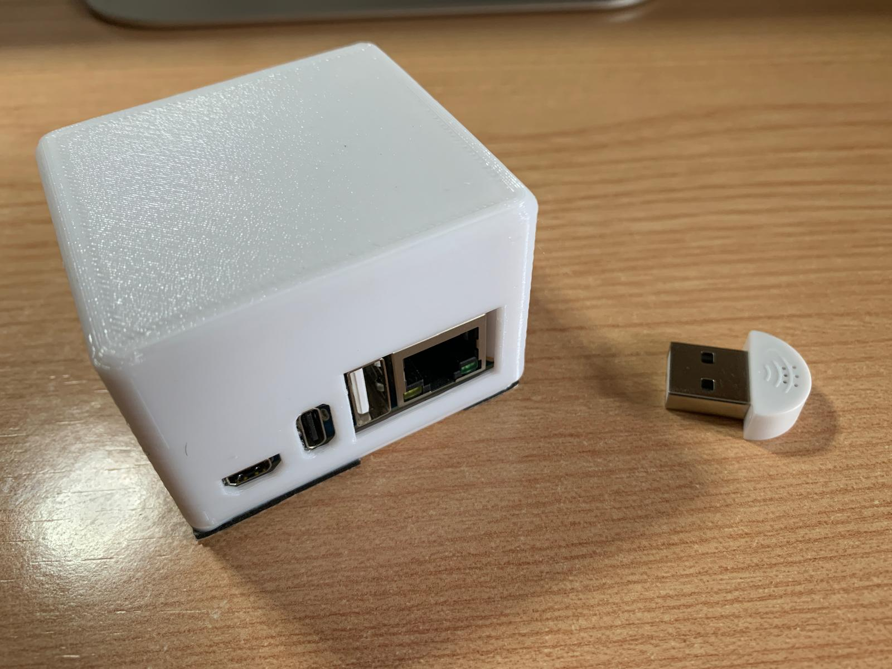
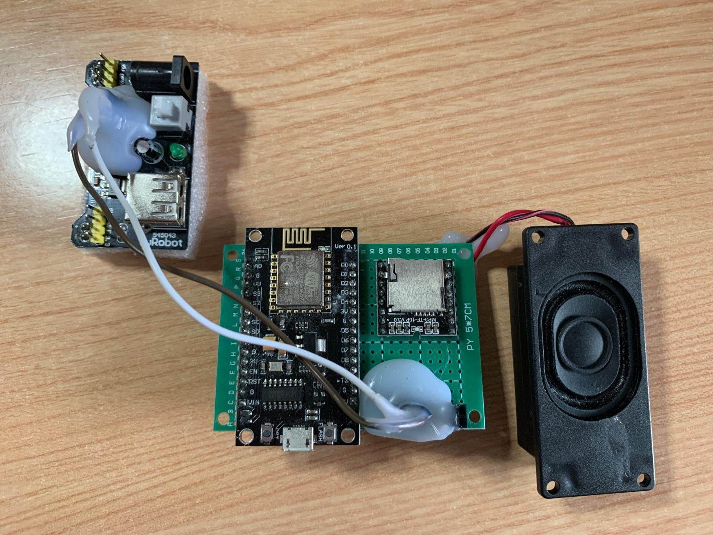

# AI-Powered Doorbell Detection System

[](https://opensource.org/licenses/MIT)

## 📋 Overview

This project develops an AI-powered system that captures and analyzes audio to detect a specific doorbell sound. Using FFT (Fast Fourier Transform) and machine learning techniques, the system can discriminate the target doorbell from ambient noise, even in noisy environments.

When the doorbell is detected, the system sends an alert through an MQTT broker to connected devices, allowing for flexible notification options including mobile notifications via Telegram.

## 🏗️ System Architecture


The system consists of several key components:

1. **Audio Capture & Processing (Orange Pi Zero3)**
   - Captures real-time audio via connected microphone
   - Runs the trained ML model for doorbell detection
   - Publishes detection events to MQTT broker

   [](docs/images/orangepi.jpeg)
   
   *Orange Pi Zero3 with USB microphone setup*
      
   *Orange Pi Zero3 in 3D printed case ([Case model on Thingiverse](https://www.thingiverse.com/thing:6162379))*

2. **MQTT Message Broker with VPS Server or local implementation (with Raspberry Pi, Orange Pi, etc.)**
   - Core communication hub - system will not function without this
   - Handles message routing between components
   - Maintains connection state and message delivery
   - Provides secure communication channel

3. **Alert System (ESP8266)**
   - Subscribes to doorbell detection events
   - Triggers MP3 playback through connected speaker
   - Sends instant notifications to your Telegram account
   - Allows remote control via Telegram commands

   [](docs/images/electronics.jpeg)
   
   *ESP8266 with DFPlayer Mini circuit setup*

## 🚀 Getting Started

### Prerequisites

#### Required MQTT Server Setup

**IMPORTANT**: A running MQTT broker is REQUIRED for this system to function. The MQTT broker acts as the central communication hub between all components. Without a properly configured MQTT server, the system will not work.

You have several options for setting up an MQTT broker:

1. **VPS Server** (Recommended):
   - Set up a VPS with your preferred provider (DigitalOcean, AWS, etc.)
   - Install and configure Mosquitto MQTT broker
   - Ensure the server is accessible from your network
   - Configure proper security (firewall rules, authentication)

2. **Local Server**:
   - Set up Mosquitto on a local machine (Raspberry Pi, Orange Pi, desktop computer)
   - Must be always running and accessible on your network
   - Configure port forwarding if remote access is needed

3. **Public MQTT Broker** (Not recommended for production):
   - Only use for testing
   - No guaranteed uptime or security
   - Limited functionality

For detailed MQTT server setup instructions, refer to the [VPS MQTT Server Configuration Guide](vps/README.md).

#### Hardware Requirements

- Orange Pi Zero3 with Ubuntu installed
- ESP8266 development board (NodeMCU or similar)
- DFPlayer Mini MP3 module (for audio playback)
- VPS server or local system for MQTT broker
- USB microphone
- Speaker (8ohm recommended)
- Python 3.8+

### Installation

**IMPORTANT**: Before proceeding with any component installation, ensure you have a running MQTT broker. The system cannot function without it.

Detailed installation instructions are available for each component:

- [VPS MQTT Server Configuration](vps/README.md) (Start here - REQUIRED)
- [Orange Pi Zero3 Setup](orangepi/README.md)
- [ESP8266 Alert System Setup](esp8266/README.md)

### Security and Environment Variables

This project uses environment variables for sensitive configuration (MQTT credentials, server addresses, etc.) following security best practices:

- All sensitive information is stored in `.env` files which are not committed to the repository
- Example configuration templates are provided as `.env.example` files
- The setup scripts check for existing configuration files before prompting for new values
- Permissions on credential files are automatically set to be readable only by the owner

When deploying this system, make sure to:
1. Never commit `.env` files with real credentials to version control
2. Keep backups of your configuration in a secure location
3. Use strong, unique passwords for all services

## 📊 Model Training

The audio detection model is trained using various samples of the target doorbell sound recorded under different conditions:
- Different distances from the doorbell
- Various background noise levels
- Different times of day/environmental conditions

The training process is documented in Jupyter notebooks in the `model_training/` directory. We provide a Makefile that facilitates setting up the environment using conda for better dependency management.

## 🔧 Hardware Requirements

### Orange Pi Zero3
- Recommended: Orange Pi Zero3 with 2GB+ RAM
- Ubuntu 22.04 LTS or compatible Linux distribution
- USB microphone with good sensitivity
- Power supply (5V/2A recommended)
- Stable internet connection (wired or wireless)
- Optional: 3D printed case for protection ([Available on Thingiverse](https://www.thingiverse.com/thing:6162379))

*3D printed case for Orange Pi Zero3*

### ESP8266
- ESP8266 development board (NodeMCU or similar)
- DFPlayer Mini MP3 module with Micro SD card for audio files
- External speaker (8ohm, 0.5W minimum)
- Power supply
- Optional: Physical doorbell button for manual triggering

[](docs/images/electronics.jpeg)

*Complete ESP8266 circuit setup with DFPlayer Mini*

## 🔌 Component Details

### Orange Pi Zero3 (Audio Processing)

The Orange Pi captures audio in real-time, processes it using a trained machine learning model, and sends notifications via MQTT when a doorbell sound is detected.

**Key Technical Features:**
- Real-time audio capture and processing
- Feature extraction using librosa (spectral contrast, MFCCs, chroma)
- TensorFlow model inference
- MQTT communication for notifications
- Runs as a systemd service for automatic start on boot

### ESP8266 Telegram Doorbell (Alert System)

The ESP8266 component receives notifications via MQTT, plays sound alerts, and integrates with Telegram for mobile notifications and remote control.

**Key Features:**
- Plays audio files using a DFPlayer Mini when doorbell is detected
- Sends instant notifications to your Telegram account
- Allows remote control via Telegram commands (volume adjustment, manual trigger)
- Provides periodic status updates to ensure the system is operational
- Configurable through a separate config file (not tracked in git for security)

**Technical Details:**
- Built on ESP8266 WiFi-enabled microcontroller
- Uses DFPlayer Mini for audio playback
- Communicates with Telegram Bot API for notifications and control
- Subscribes to MQTT topics for integration with alarm systems or other triggers

### MQTT Message Broker (VPS) [REQUIRED]

The MQTT server is the critical communication hub between the Orange Pi and the ESP8266 alert system. Without it, the system cannot function.

**Key Features:**
- Acts as the central communication hub (REQUIRED)
- Handles message routing between components
- Provides authentication and secure communication
- Optionally sends notifications through other channels (email, SMS)
- Logs events for monitoring and debugging

**Setup Options:**
1. VPS Server (Recommended)
2. Local Server (e.g., on a Raspberry Pi)
3. Public Broker (Testing only)

For detailed setup instructions and troubleshooting, see [VPS MQTT Server Configuration](vps/README.md).

## 🧠 ML Model Architecture

The doorbell detection system uses a neural network model trained on audio features:
- Spectral contrast (energy concentration across frequency bands)
- MFCCs (Mel-frequency cepstral coefficients)
- Chroma features (12 semitone pitch classes)

The model is designed to be lightweight enough to run on the Orange Pi while maintaining high accuracy.

## 🛠️ Development Setup

### Orange Pi Development
For working with the Orange Pi components:
- Python 3.8+
- Required libraries: tensorflow, librosa, numpy, paho-mqtt, etc.
- Environment setup via the provided setup scripts

### ESP8266 Development
For working with the ESP8266 components:
1. Install Arduino IDE (version 1.8.x or later)
2. Add ESP8266 board support:
   - Go to File > Preferences
   - Add `http://arduino.esp8266.com/stable/package_esp8266com_index.json` to Additional Boards Manager URLs
   - Install the ESP8266 package from Tools > Board > Boards Manager
3. Install required libraries through Library Manager:
   - ESP8266WiFi: For WiFi connectivity
   - SoftwareSerial: For communication with the DFPlayer Mini
   - DFRobotDFPlayerMini: For controlling the DFPlayer Mini module
   - CTBot: For Telegram bot integration
   - ArduinoJson: For JSON parsing (version 6.19.4 recommended)
   - PubSubClient: For MQTT communication
4. Select the correct board (e.g., NodeMCU 1.0) and port
5. Compile and upload the code

**Debugging Tips:**
- Use Serial Monitor (115200 baud) for debugging output
- Enable verbose output during compilation for better error detection
- Use platformio.ini for more advanced project management (optional)

## 🔍 Troubleshooting

Common troubleshooting steps for each component are documented in their respective README files:
- [Orange Pi Troubleshooting](orangepi/README.md#troubleshooting)
- [ESP8266 Troubleshooting](esp8266/README.md#troubleshooting)
- [MQTT Server Troubleshooting](vps/README.md#troubleshooting)

## 🔐 Security Considerations

- Configuration files containing sensitive information (WiFi credentials, API tokens, etc.) are excluded from git tracking
- Each component has its own `.gitignore` to prevent accidental credential exposure
- For production deployments, consider additional security measures like:
  - Network segmentation for IoT devices
  - Strong, unique passwords
  - Regular firmware updates

## 🤝 Contributing

Contributions are welcome! Please feel free to submit a Pull Request.

1. Fork the repository
2. Create your feature branch (`git checkout -b feature/amazing-feature`)
3. Commit your changes (`git commit -m 'Add some amazing feature'`)
4. Push to the branch (`git push origin feature/amazing-feature`)
5. Open a Pull Request

## 📝 Project TODOs and Issues

We use GitHub Issues to track tasks, enhancements, and bugs for this project. If you find a TODO comment in the code, please consider:

1. **Creating an Issue**: Convert code TODOs into GitHub Issues for better tracking
2. **Labeling appropriately**: Use labels like `enhancement`, `bug`, or `documentation`
3. **Referencing in commits**: When addressing a TODO, reference the issue number in your commit message

Current TODOs:
- Implement loading of environment variables from `.env` file in `orangepi/setup.sh`
- [Add your TODOs here]

To find all TODOs in the codebase, you can run:
```bash
grep -r "TODO" --include="*.py" --include="*.sh" --include="*.ino" .
```

## 📜 License

This project is licensed under the MIT License - see the [LICENSE](LICENSE) file for details.

## 📞 Contact

Project Link: [https://github.com/EnriqueMF/doorbell-ai-detection](https://github.com/EnriqueMF/doorbell-ai-detection)