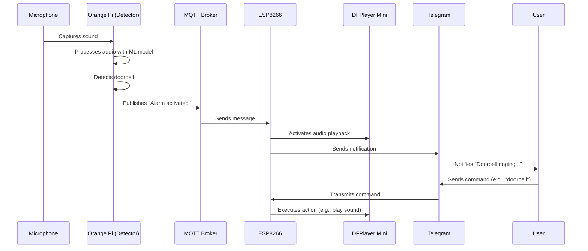
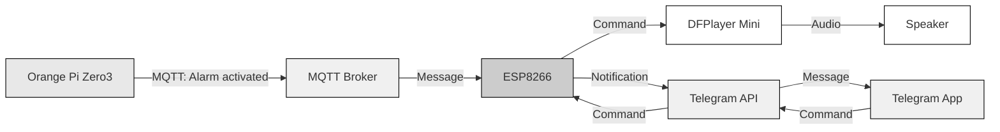
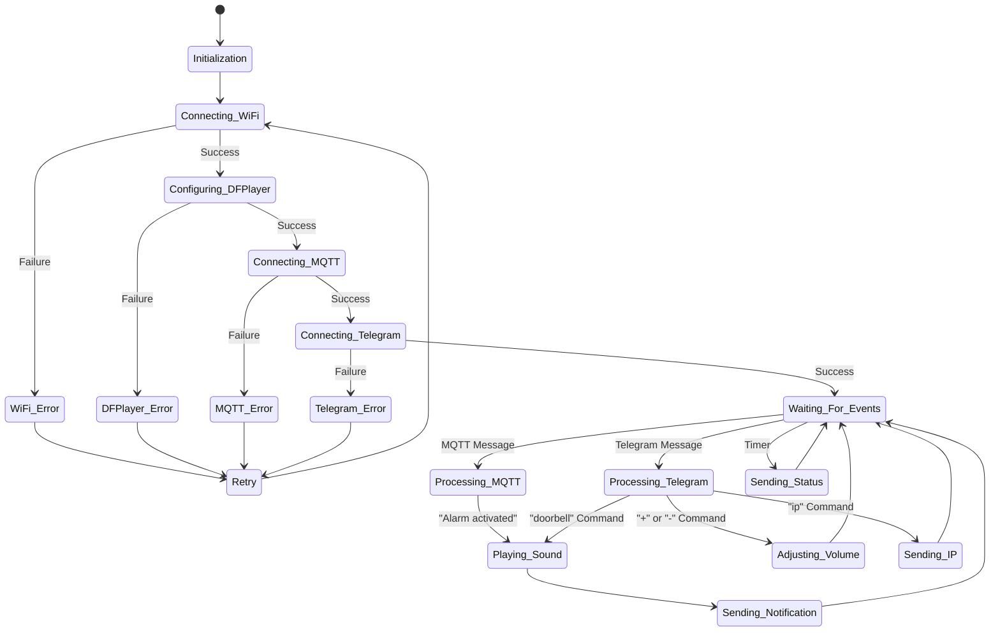
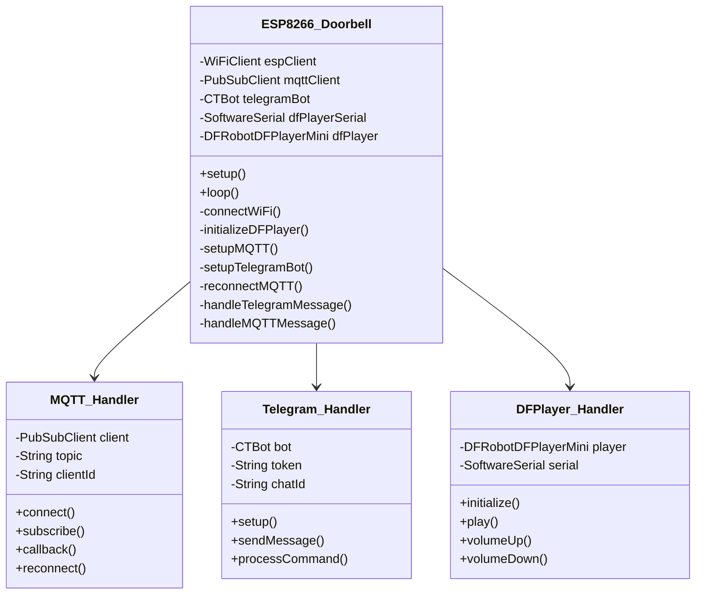

# ESP8266 System Diagrams

This document contains diagrams illustrating how the ESP8266 component interacts with the rest of the doorbell detection system.

## System Diagram

```mermaid
graph TD
    subgraph "Doorbell Detection System"
        subgraph "Orange Pi Zero3"
            A[Microphone] -->|Captures Audio| B[doorbell_detector.py]
            B -->|Processes Audio| C[TensorFlow Model]
            C -->|Detects Doorbell| D[mqtt_client.py]
            D -->|Publishes Message| E[MQTT Broker]
        end
        
        subgraph "ESP8266"
            F[PubSubClient] -->|Subscribed to| E
            F -->|Receives Message| G[DFPlayer Mini]
            G -->|Plays Sound| H[Speaker]
            F -->|Notifies| I[Telegram Bot]
            I -->|Sends Message| J[Telegram User]
            J -->|Sends Commands| I
            I -->|Controls| G
        end
        
        E -->|"Message: Alarm activated"| F
    end
    
    style Orange Pi Zero3 fill:#E8E8E8,stroke:#000000,stroke-width:2px
    style ESP8266 fill:none,stroke:#000000,stroke-width:2px 
    style A fill:#000000,stroke:#000000,stroke-width:1px
    style B fill:#000000,stroke:#000000,stroke-width:1px
    style C fill:#000000,stroke:#000000,stroke-width:1px
    style D fill:#000000,stroke:#000000,stroke-width:1px
    style E fill:#000000,stroke:#000000,stroke-width:1px
    style F fill:#000000,stroke:#000000,stroke-width:1px
    style G fill:#000000,stroke:#000000,stroke-width:1px
    style H fill:#000000,stroke:#000000,stroke-width:1px
    style I fill:#000000,stroke:#000000,stroke-width:1px
    style J fill:#000000,stroke:#000000,stroke-width:1px
```

## Sequence Diagram

## Data Flow Diagram

## ESP8266 State Diagram

## ESP8266 Software Architecture

