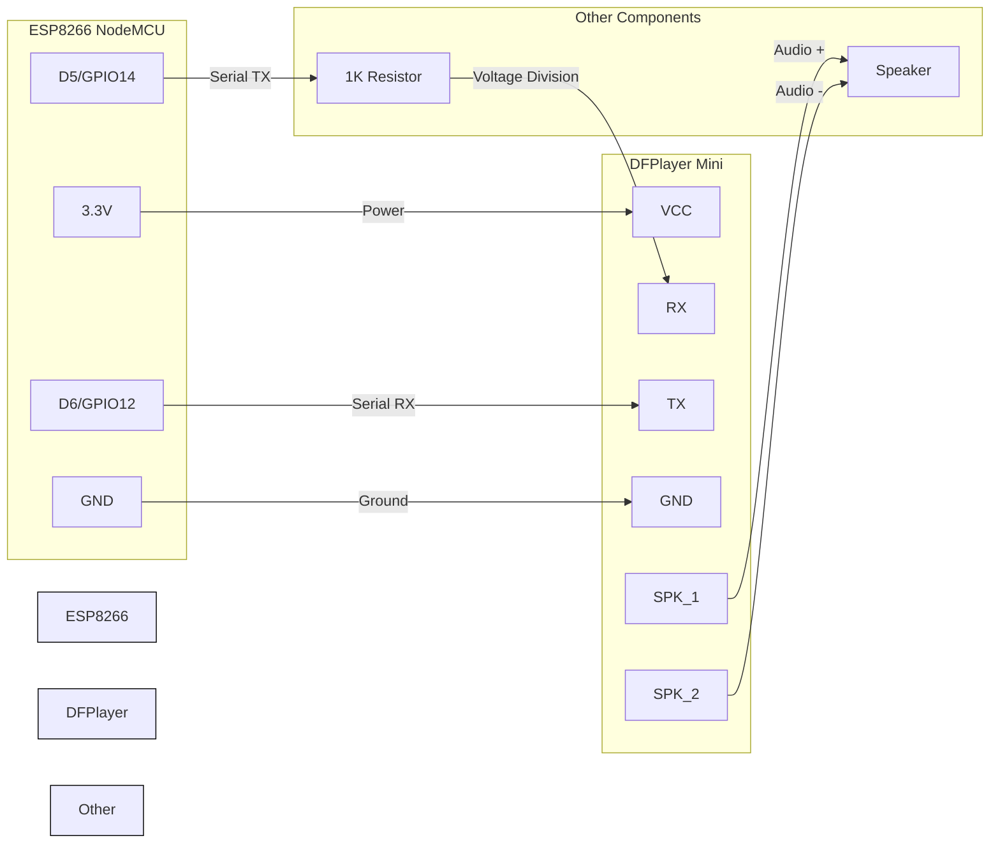
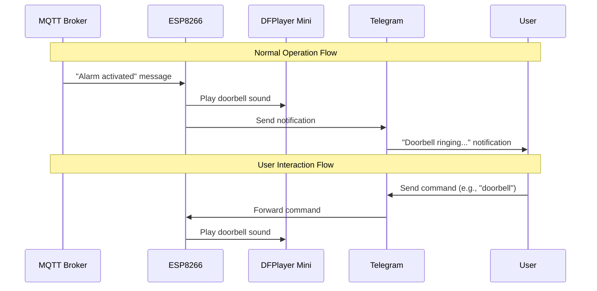
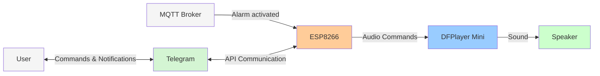
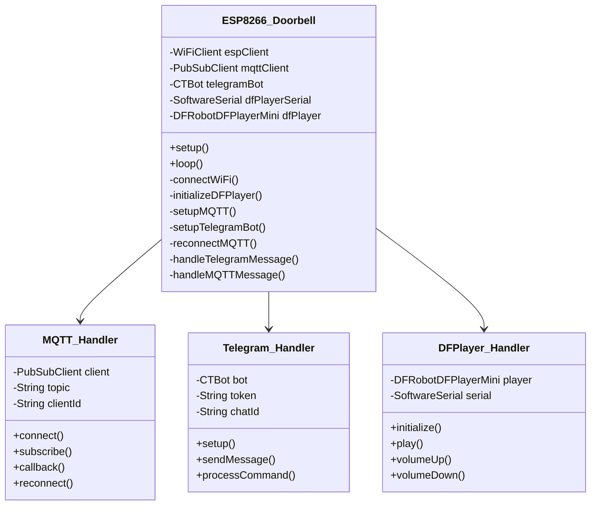

# ESP8266 System Interaction Diagram

This document illustrates how the ESP8266 interacts with other components in the doorbell detection system.

## Electronic Interaction Diagram

```mermaid
graph TD
    subgraph "External Systems"
        A[MQTT Broker] -->|"Alarm activated"| B[ESP8266 NodeMCU]
        T[Telegram API] <-->|Commands & Notifications| B
    end

    subgraph "ESP8266 System"
        B -->|"TX (D5) → SoftwareSerial"| C[DFPlayer Mini]
        C -->|"TX → RX (D6)"| B
        C -->|"Audio Output"| D[Speaker]
        
        subgraph "ESP8266 Internal"
            B1[WiFi Module] <--> B2[PubSubClient]
            B2 <--> B3[Main Controller]
            B3 <--> B4[SoftwareSerial]
            B3 <--> B5[CTBot Library]
        end
        
        subgraph "DFPlayer Mini Internal"
            C1[Serial Interface] <--> C2[MP3 Decoder]
            C2 <--> C3[SD Card Reader]
            C2 <--> C4[Audio Amplifier]
        end
        
        B4 <-->|"Serial Communication"| C1
        C4 --> D
        B5 <-->|"HTTPS"| T
    end
    
    style External Systems fill:#f5f5f5,stroke:#333,stroke-width:1px
    style ESP8266 System fill:#ffffff,stroke:#333,stroke-width:2px
    style ESP8266 Internal fill:#ffffff,stroke:#333,stroke-width:1px
    style DFPlayer Mini Internal fill:#e6f2ff,stroke:#333,stroke-width:1px
    style B fill:#000000,stroke:#333,stroke-width:1px
    style C fill:#000000,stroke:#333,stroke-width:1px
    style D fill:#000000,stroke:#333,stroke-width:1px
```



## ESP8266 to DFPlayer Mini Wiring Diagram



## Connection Notes

1. **Power Supply**:
   - DFPlayer Mini requires 3.3V-5V power. The ESP8266 3.3V output is sufficient.
   - Both devices share a common ground.

2. **Serial Communication**:
   - ESP8266 D5 (GPIO14) connects to DFPlayer RX through a 1K resistor for voltage protection.
   - ESP8266 D6 (GPIO12) connects directly to DFPlayer TX.
   - The SoftwareSerial library is used to establish communication.

3. **Speaker Connection**:
   - Connect an 8Ω speaker between SPK_1 and SPK_2 pins of the DFPlayer Mini.
   - For better audio quality, a small amplifier can be added.

4. **SD Card**:
   - The DFPlayer Mini requires a micro SD card (not shown in diagram) with MP3 files.
   - Files should be named in format: 001.mp3, 002.mp3, etc.

## Communication Protocol

The ESP8266 communicates with the DFPlayer Mini using a simple serial protocol:

```
Command format: 0x7E FF 06 CMD FEEDBACK PARAM1 PARAM2 EFxx FF
```

Where:
- `0x7E`: Start code
- `FF`: Version info
- `06`: Data length (6 bytes)
- `CMD`: Command code (e.g., 0x03 for PLAY)
- `FEEDBACK`: 0x00 (no feedback) or 0x01 (feedback)
- `PARAM1, PARAM2`: Parameters (e.g., track number)
- `EFxx`: Checksum
- `FF`: End code

Common commands:
- `0x03`: Play track (PARAM1, PARAM2 = track number)
- `0x04`: Play with volume (PARAM1 = volume, PARAM2 = track)
- `0x06`: Set volume (PARAM1 = 0, PARAM2 = volume level 0-30)
- `0x0C`: Reset module

## Communication Flow



## Data Flow Diagram



## ESP8266 Software Architecture

